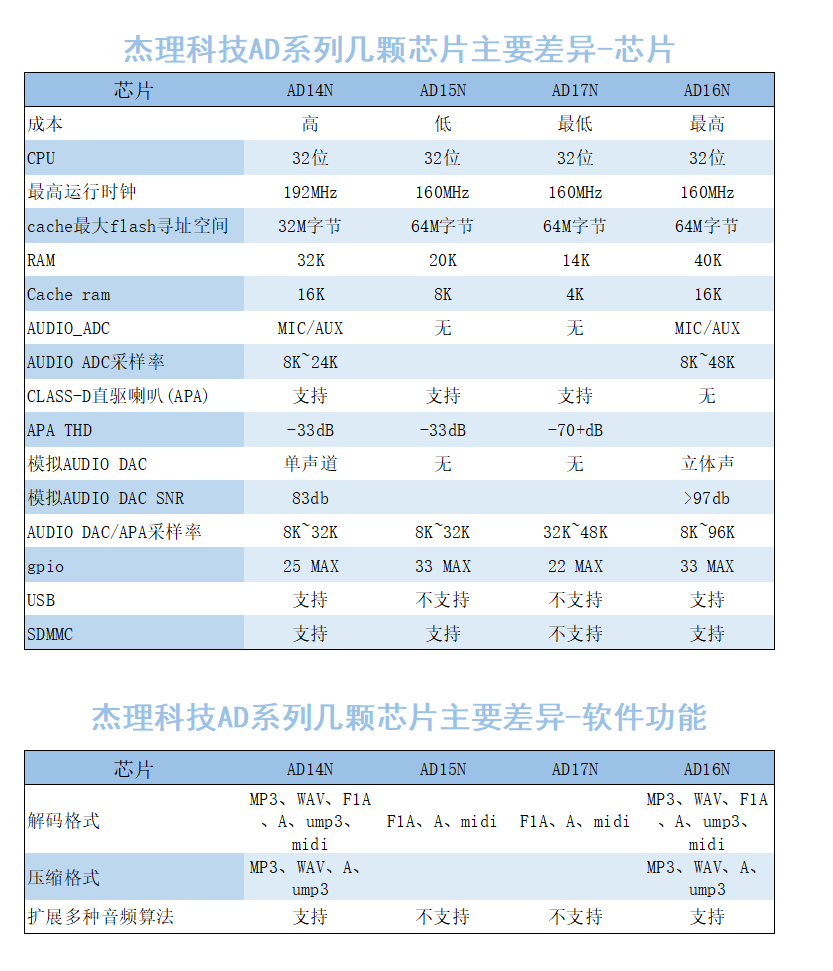

# fw-AD6N
About Firmware for Generic MCU SDK（AD16N series）, Support AD16N

[tag download]:https://github.com/Jieli-Tech/fw-AD16N/tags
[tag_badgen]:https://img.shields.io/github/v/tag/Jieli-Tech/fw-AD16N?style=plastic&labelColor=ffffff&color=informational&label=Tag&

# fw-AD16N_SDK   [![tag][tag_badgen]][tag download]

中文 | [EN](./README-en.md)

AD16N 系列通用MCU SDK 固件程序

本仓库包含SDK release 版本代码，线下线上支持同步发布，支持玩具类、小音箱类产品和通用MCU类应用二次开发.

本工程提供的例子，需要结合对应命名规则的库文件(lib.a) 和对应的子仓库进行编译.

快速开始
------------

欢迎使用杰理开源项目，在开始进入项目之前，请详细阅读SDK 介绍文档，
从而获得对杰理系列芯片和SDK 的大概认识，并且可以通过快速开始介绍来进行开发.

工具链
------------

关于如何获取`杰理工具链` 和 如何进行环境搭建，请阅读以下内容：

* 编译工具 ：请安装杰理编译工具来搭建起编译环境, [下载链接](https://pan.baidu.com/s/1f5pK7ZaBNnvbflD-7R22zA) 提取码: `ukgx`
* 编译器邀请码：4VlZaQCq-lImlZX2u-GBeCs501-ektNxDGu

* USB 升级工具 : 在开发完成后，需要使用杰理烧写工具将对应的`hex`文件烧录到目标板，进行开发调试, 关于如何获取工具请进入申请 [链接](https://item.taobao.com/item.htm?spm=a1z10.1-c-s.w4004-22883854875.5.504d246bXKwyeH&id=620295020803) 并详细阅读对应的[文档](doc/stuff/usb%20updater.pdf)，以及相关下载脚本[配置](doc/stuff/ISD_CONFIG.INI配置文件说明.pdf)

介绍文档
------------

* 芯片简介 : [SoC 数据手册扼要](./doc)

* 芯片选型号手册 : [SoC 选型手册](./doc/README.md)

* SDK 版本信息 : [SDK 历史版本](doc/AD16N_FLASH_SDK_发布版本信息.pdf)

* SDK 介绍文档 : [SDK 快速开始简介](./doc/AD16N_SDK手册_V1.1.pdf)

* SDK 结构文档 : [SDK 模块结构](./doc/)

* 视频资源 : [视频链接](https://space.bilibili.com/3493277347088769/dynamic)

* FAE 支持文档 : [FAE支持](https://gitee.com/jieli-tech_fae/fw-jl)

SDK 培训视频
------------
[AD16N FLASH SDK 培训视频链接](https://www.bilibili.com/video/BV15T411a7YE/?spm_id_from=333.337.search-card.all.click&vd_source=254273a14d3e073e6006d61b2acafb16)

编译工程
-------------
请选择以下一个工程进行编译，下列目录包含了便于开发的工程文件：

* 玩具及小音箱类应用 : ./sdk/AD16N_flash.cbp, 适用领域：

即将发布：
------------

SDK 支持Codeblock编译环境，请确保编译前已经搭建好编译环境，

* Codeblock 编译 : 进入对应的工程目录并找到后缀为 `.cbp` 的文件, 双击打开便可进行编译.

* Makefile 编译 : `apps/app_cfg` 开始编译之前，需要先选择好目标应用并编辑保存, 请双击 `make_prompt` 并输入 `make`

  `在编译下载代码前，请确保USB 升级工具正确连接并且进入编程模式`
  

硬件环境
-------------

* 开发评估板 ：开发板申请入口[链接](https://item.taobao.com/item.htm?spm=a230r.1.14.16.3515573bt22ZGR&id=696613076397&ns=1&abbucket=17#detail)

* 生产烧写工具 : 为量产和裸片烧写而设计, 申请入口 [连接](https://item.taobao.com/item.htm?spm=a1z10.1-c-s.w4004-22883854875.8.504d246bXKwyeH&id=620941819219) 并仔细阅读相关 [文档](./doc/stuff/烧写器使用说明文档.pdf)
  
打包工具&音频文件转换工具
-------------

* [下载链接](https://pan.baidu.com/s/1ajzBF4BFeiRFpDF558ER9w#list/path=%2F) 提取码：`3jey` 

SDK主要功能
-------------
* 支持内置FLASH的解码播放
* 支持外置FLASH的解码播放
* 支持SDMMC卡的解码播放
* 支持u-disk的解码播放
* 支持usb-slave speaker
* 支持usb-slave mic
* 支持usb-slave hid 
* 支持解码MIO功能
* 支持.a/.b/.e格式解码播放
* 支持f1a/.f1b/.f1c/.f1x格式解码播放
* 支持ump3格式解码播放
* 支持标准mp3解码播放
* 支持MIDI播放
* 支持变速变调（不过需要把系统时钟调整到100Mhz以上）
* 最多支持.a/.b/.e + .f1a/.f1b/.f1c 两路音频同时解码播放
* 支持标准 MP2、 UMP3、 A 等格式的编码录音；
* AUDIO_DAC 支持双声道输出， 
* AUDIO_DAC 支持 8K、 11.025K、 12k、 16K、22.05k、 24K、 32K、 44.1k、 48k、 64k、 88.2k、 96k 采样率；
* AUDIO_ADC 支持单声道单端输入， 支持 8K、 1.025K、 12k、 16K、 22.05k、 24K、 32K、44.1k、 48k 采样率；
* 支持数字 LINEIN 和模拟直通 LINEIN；
* 支持数码管 UI 显示；
* 支持 ADC、 IO、 红外、 矩阵按键， 支持按键音；
* 支持 VM 掉电记忆， 记忆数据保存在内置 FLASH 中；
* 支持充电管理；
* 支持硬件的重采样
* 支持 SOFT OFF 关机和 POWER DOWN 休眠， 关机功耗 1.7uA+， 休眠功耗 38uA+；

MCU信息
-------------
* RISC / 160MHz /40K+16K
* flash / 2Mbit / 4Mbit
* UART * 2 / IIC / SPI * 2
* 10bit ADC
* 16bit audio DAC
* 16bit audio ADC
* LCD Controler
* LED Controler
* RAND64
* TDM
* RDEC(旋转编码器)
* SD IO
* IR
* MCPWM * 8
* 32 bit timer * 3
* 37 * GPIO

社区
--------------

* 技术交流群[钉钉](./doc/stuff/dingtalk.jpg)

免责声明
------------

AD16N_SDK 支持AD16 系列芯片开发.
AD16N 系列芯片支持了通用MCU 常见应用，可以作为开发，评估，样品，甚至量产使用，对应SDK 版本见Release
