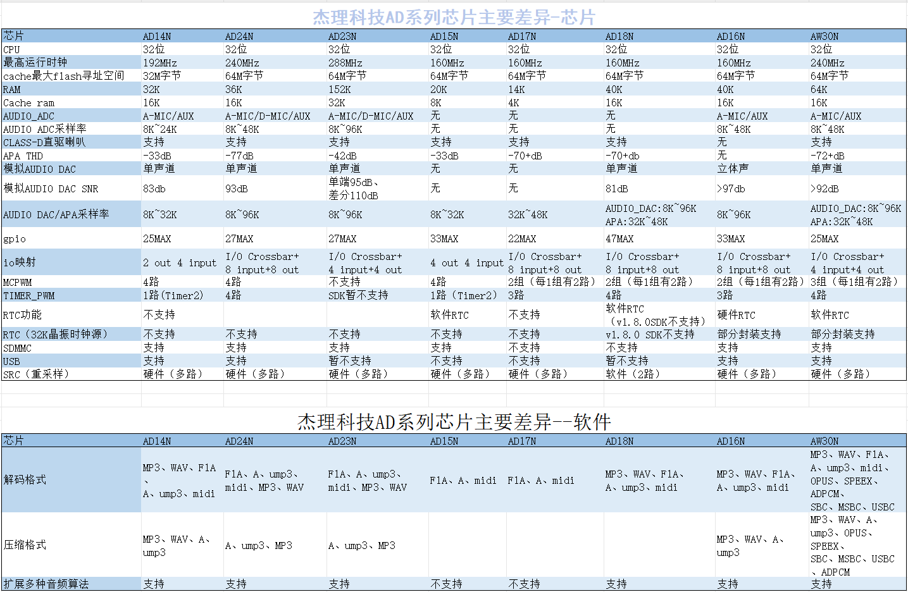

[tag download]:https://github.com/Jieli-Tech/fw-AD16N/tags
[tag_badgen]:https://img.shields.io/github/v/tag/Jieli-Tech/fw-AD16N?style=plastic&labelColor=ffffff&color=informational&label=Tag&

# fw-AD16N_GP-MCU_SDK  [![tag][tag_badgen]][tag download]

<div align="center">

**杰理 AD16N 系列通用 MCU SDK 固件程序**

[English](./README-en.md) · [文档中心](doc/AD16N_开源SDK手册_V1.2.pdf) · [SDK 版本历史](doc/AD16N_FLASH_SDK_发布版本信息.pdf) · [报告问题](https://github.com/Jieli-Tech/fw-AD16N/issues)

</div>

---

## 目录

- [一、概述](#一概述)
- [二、支持的芯片与平台](#二支持的芯片与平台)
- [三、环境搭建](#三环境搭建)
- [四、快速开始](#四快速开始)
- [五、工程结构](#五工程结构)
- [六、应用与示例](#六应用与示例)
- [七、编译指南](#七编译指南)
- [八、烧录与升级](#八烧录与升级)
- [九、配置说明](#九配置说明)
- [十、常见问题](#十常见问题)
- [十一、社区与支持](#十一社区与支持)
- [十二、免责声明](#十二免责声明)

---

## 一、概述

`fw-AD16N_GP-MCU_SDK` 是杰理科技为 AD16N 系列芯片提供的通用 MCU SDK 开发包。本系列芯片主要面向以下应用场景：

| 应用类型 | 典型产品 |
|---------|---------|
| **语音玩具** | 故事机、学习机、MIDI 乐器 |
| **小音箱** | MP3 音乐播放器、录音笔、扩音器 |
| **通用 MCU** | 智能控制、传感器采集、USB 音频设备 |

### 核心特性

- **音频解码**：支持 .a/.b/.e、.f1a/.f1b/.f1c/.f1x 等多种音频格式解码播放
- **MP3 解码**：支持标准 MP3、WMA、WAV 格式硬件解码
- **MIDI 播放**：支持 MIDI 合成与播放
- **音频编码**：支持 MP2、UMP3、A 等格式编码录音
- **多路播放**：最多支持 .a/.b/.e + .f1a/.f1b/.f1c 两路音频同时解码播放
- **变速变调**：支持音频变速变调播放（需系统时钟 100MHz 以上）
- **硬件重采样**：内置硬件重采样
- **内置音频编解码**：16bit DAC 双声道输出 + 16bit ADC 单声道输入，支持 8K–96K 采样率
- **多段 EQ/DRC**：支持多段 EQ 配置和 DRC 限幅器
- **低功耗**：关机功耗低至 1.7µA+
- **多种存储**：支持内置/外置 FLASH、SD/MMC 卡、U 盘、FAT 文件系统
- **充电管理**：内置锂电池充电管理，最大 120mA
- **LCD 驱动**：部分型号支持段码 LCD / 数码管显示
- **OTP 存储器**：内置 32KB OTP（One-Time Programmable），可直接运行代码，无需外挂 Flash 即可工作

本仓库包含 SDK Release 版本代码及示例工程，需配合对应命名规则的库文件 (`lib.a`) 进行编译。

---

## 二、支持的芯片与平台

### 2.1 SoC 系列

| 芯片系列 | 应用领域 |
|---------|---------|
| AD160A / AD161A | 通用 MCU / 音频播放（支持 LCD、QFN52/LQFP48 大封装） |
| AD162A/B/C/D | 小音箱 / 音频播放（SOP16 小封装，内置 Flash） |
| AD165A/C/D | 小音箱 / 通用 MCU（QSOP24） |
| AD166A | 通用 MCU / 音频播放（QFN32） |
| AD168A | 小音箱 / 音频播放（SOP8 最小封装） |

> 芯片型号/规格书/原理图资料请查阅：[doc/ 目录](doc/)

### 2.2 MCU 软硬件参数差异



---

## 三、环境搭建

### 3.1 前提条件

| 系统 | 说明 |
|------|------|
| **Windows** | 推荐使用 Code::Blocks IDE 编译 |
| **Linux** | Makefile 命令行编译（需要重写 download_sh.c 脚本适配 Linux 环境） |
| **macOS** | 需自行配置交叉编译工具链 |

### 3.2 安装编译工具链

1. 下载并安装 **杰理编译工具链**：[下载链接](https://doc.zh-jieli.com/Tools/zh-cn/dev_tools/dev_env/index.html)
2. Linux 用户可从此处下载：[pkgman.jieliapp.com](http://pkgman.jieliapp.com/doc/all)
   - 下载后解压到 `/opt/jieli` 目录
   - 确保 `/opt/jieli/pi32/bin/clang` 存在
3. 安装完成后验证：

```bash
# 验证工具链是否安装成功
clang --version
```

### 3.3 安装烧录工具

| 工具 | 用途 | 获取方式 |
|------|------|---------|
| **USB 升级工具** | 将固件烧录到目标板 | [申请链接](https://item.taobao.com/item.htm?id=620295020803) · [使用文档](https://doc.zh-jieli.com/Tools/zh-cn/dev_tools/forced_upgrade/index.html) |
| **生产烧写工具** | 量产/裸片烧写 | **代理商处** · [使用文档](https://doc.zh-jieli.com/Tools/zh-cn/mass_prod_tools/burner_1tuo2/index.html) |

---

### 3.4 音频工具

打包、音频文件转换、MIDI 等通用音频工具：[下载链接](https://pan.baidu.com/s/1ajzBF4BFeiRFpDF558ER9w#list/path=%2F) 提取码：`3jey`

---

## 四、快速开始

### 4.1 克隆仓库

```bash
git clone https://github.com/Jieli-Tech/fw-AD16N.git
cd fw-AD16N/sdk
```

### 4.2 工程入口

SDK 包含以下应用工程，位于 `sdk/` 根目录：

| 工程文件 | 芯片 | 应用类型 |
|---------|------|---------|
| `AD16N_mbox_flash.cbp` | AD16N 全系列 | 小音箱 / 音频播放 |

### 4.3 应用代码入口

```
sdk/apps/app/src/mbox_flash/    # 小音箱/音频播放应用
```

### 4.4 编译并烧录

**方式一：Code::Blocks（推荐 Windows 用户）**

1. 双击打开 `AD16N_mbox_flash.cbp` 工程文件
2. 点击 **Build → Build**（Ctrl+F9）
3. 编译成功后，使用 USB 升级工具烧录生成的固件

**方式二：Makefile 命令行**

```bash
# Windows 用户
双击 sdk/make_prompt.bat 打开命令行环境

# 编译
make -j4

# 显示编译详情
make VERBOSE=1 -j4
```

> **💡 提示**：编译前请确保 USB 升级工具正确连接且目标板已进入编程模式。


**方式三：VS Code 编译**

仓库已预配置 VS Code 任务，按 `Ctrl+Shift+B` 即可选择编译目标。

---

## 五、工程结构

```
fw-AD16N/
├── sdk/                           # SDK 主目录
│   ├── apps/                      # 应用层代码
│   │   ├── app/                   #   应用入口源码
│   │   │   ├── src/               #     应用源码
│   │   │   │   └── mbox_flash/    #       小音箱/音频播放应用
│   │   │   ├── bsp/               #     板级支持包（BSP）
│   │   │   └── post_build/        #     编译后处理脚本与工具
│   │   └── include_lib/           #   头文件与预编译库
│   │       ├── cpu/               #     CPU 平台头文件
│   │       ├── decoder/           #     解码器 API 头文件
│   │       ├── encoder/           #     编码器 API 头文件
│   │       ├── audio/             #     音频 API 头文件
│   │       ├── device/            #     设备驱动头文件
│   │       ├── common/            #     公共头文件
│   │       ├── config/            #     配置头文件
│   │       ├── sound_effect_list/ #     音效算法
│   │       ├── pcm_eq/            #     PCM EQ
│   │       ├── msg/               #     消息机制
│   │       ├── update/            #     固件升级
│   │       ├── apple_dock/        #     Apple Dock
│   │       └── liba/              #     预编译库 (.a)
│   ├── tools/                     # 编译工具与脚本
│   │   ├── make_prompt.bat        #   Windows 编译命令行入口
│   │   └── utils/                 #   工具集（make、rm 等）
│   ├── midi_2byte.bat             # MIDI 2字节模式切换
│   ├── midi_4byte.bat             # MIDI 4字节模式切换
│   ├── MIDI_VER_SELECT.bat        # MIDI 版本选择
│   ├── Makefile                   # 顶层 Makefile
│   └── *.cbp                      # Code::Blocks 工程文件
├── doc/                           # 文档
│   ├── datasheet/                 #   芯片规格书
│   ├── schematic/                 #   原理图
│   ├── stuff/                     #   杂项（钉钉群等）
│   ├── README.md                  #   芯片选型说明
│   ├── AD16N_FLASH_SDK_发布版本信息.pdf  # SDK 发布版本信息
│   ├── AD16N_开源SDK手册_V1.2.pdf    # SDK 手册
│   ├── AD16N_芯片手册_V1.2.pdf       # 芯片手册
│   ├── AD16N通用音频MCU硬件设计指南V1.3.pdf  # 硬件设计指南
│   └── 杰理科技32位AD系列语音MCU选型表.pdf  # 芯片选型表
└── README.md                      # 本文件
```

---

## 六、应用与示例

### 6.1 小音箱/音频播放应用 (`apps/app/src/mbox_flash/`)

| 功能 | 说明 |
|-------|------|
| **音乐播放** | 本地/外置 FLASH、SD 卡、U 盘文件播放（支持 MP3/WMA/WAV/.a/.b/.e/.f1a/.f1b/.f1c 等） |
| **MIDI 演奏** | MIDI 合成与播放 |
| **录音** | MP2/UMP3/A 格式编码录音 |
| **USB Device** | USB 从设备（Speaker / MIC / HID / MSD） |
| **LINEIN** | 数字 LINEIN 和模拟直通 LINEIN |
| **扩音** | 扩音/喊话功能 |

适用领域：便携音箱、MP3 播放器、语音玩具、故事机、USB 音频设备等。

---

## 七、编译指南

### 7.1 编译命令速查表

以下命令在 `sdk/` 目录下执行：

| 目标 | 命令 |
|------|------|
| **编译** | `make -j4` |
| **编译（verbose）** | `make VERBOSE=1 -j4` |
| **清理** | `make clean` |

### 7.2 Code::Blocks 编译（推荐 Windows 用户）

1. 确保已安装杰理编译工具链
2. 双击 `AD16N_mbox_flash.cbp` 工程文件打开 Code::Blocks
3. 点击 **Build → Build**（Ctrl+F9）
4. 编译成功后在 `post_build/` 目录下生成固件

### 7.3 Makefile 编译

```bash
# Windows 用户
双击 sdk/make_prompt.bat 打开命令行环境
make -j4

# Linux 用户（需要自行修改download_sh.c文件适配Linux）
cd sdk
make -j`nproc`
```

### 7.4 常见编译错误

| 错误提示 | 解决方法 |
|---------|---------|
| `clang: command not found` | 未安装杰理编译工具链，或环境变量未配置 |
| `cannot find -lxxx` | 缺少对应的 `.a` 库文件，检查 `apps/include_lib/liba/` 目录 |
| `make: command not found` | Windows 下使用 `tools/make_prompt.bat` 打开编译命令环境 |
| 链接错误 | 检查 Makefile target 是否匹配当前芯片型号 |

---

## 八、烧录与升级

### 8.1 首次烧录

1. **连接硬件**：将开发板通过 **USB** 或者 **USB 升级工具** 连接到 PC
2. **进入编程模式**：
    - 方式一（USB）：按住开发板上的烧录按键，然后复位或重新上电
    - 方式二（USB/UART）：通过 USB 升级工具进入编程模式
3. **打开 USB 升级工具**：启动烧录上位机
4. **选择固件**：选择编译生成的固件文件
5. **开始烧录**：点击下载按钮，等待烧录完成

> **注意**：烧录前请确保 USB 升级工具正确连接且目标板已进入编程模式。关于 ISD_CONFIG.INI 配置详见 [ISD 配置说明](https://doc.zh-jieli.com/Tools/zh-cn/dev_tools/toolchains/ini_cfg.html)。

### 8.2 生产烧写

量产场景请使用杰理生产烧写工具（一拖二 / 一拖八），支持裸片烧写。详见 [一拖二烧写器使用说明](https://doc.zh-jieli.com/Tools/zh-cn/mass_prod_tools/burner_1tuo2/index.html) · [一拖八烧写器使用说明](https://doc.zh-jieli.com/Tools/zh-cn/mass_prod_tools/burner_1tuo8/index.html)

### 8.3 OTA 升级

支持自定义双备份固件升级，常见方式包括 U 盘升级、SD 卡升级、串口升级等。

---

## 九、配置说明

- 编辑 `sdk/apps/app/src/mbox_flash/app_config.h` 可配置目标应用的功能开关

---

## 十、常见问题

### 10.1 开发流程相关

**Q: 如何选择不同的芯片型号？**
A: 通过 Makefile 选择对应 target，或修改 `app_config.h` 中的芯片配置。

**Q: 如何切换内置/外置 FLASH？**
A: 在配置中指定 Flash 类型，外置 Flash 通过 SPI Flash 控制器访问。

### 10.2 编译相关

**Q: Windows 下编译报错 `make` 不是有效命令？**
A: 使用 `sdk/make_prompt.bat` 进入预配置的命令行环境，该脚本已设置好所有环境变量和 `make` 的路径。

**Q: 如何加快编译速度？**
A: 使用 `-j` 参数进行并行编译，如 `make -j4`（数字为并行任务数）。

### 10.3 调试技巧

- **串口日志**：可通过 UART 输出调试日志
- **GPIO Debug**：利用空闲 GPIO 输出调试波形，测量时序

---

## 十一、社区与支持

### 技术交流

| 平台 | 群号/链接 | 状态 |
|------|-----------|------|
| **钉钉技术交流群** | 见 [群二维码](doc/stuff/dingtalk.jpg) | ✅ 可加入 |

### 资源链接

| 资源 | 链接 |
|------|------|
| 📖 **杰理工具在线文档** | [doc.zh-jieli.com/Tools](https://doc.zh-jieli.com/Tools/zh-cn/index.html) |
| 📚 **SDK 版本历史** | [SDK 发布版本信息](doc/AD16N_FLASH_SDK_发布版本信息.pdf) |
| 🔧 **SDK 快速入门** | [SDK 手册](doc/AD16N_开源SDK手册_V1.2.pdf) |
| 📄 **芯片选型** | [选型表](doc/杰理科技32位AD系列语音MCU选型表.pdf) · [选型说明](doc/README.md) |
| 🎬 **视频教程** | [Bilibili 主页](https://space.bilibili.com/3493277347088769/dynamic) |
| 🎬 **SDK 培训视频** | [AD16N FLASH SDK 培训](https://www.bilibili.com/video/BV15T411a7YE/) |
| 🎵 **MIDI 开发手册** | [MIDI 应用开发文档](https://doc.zh-jieli.com/MIDI/zh-cn/master/index.html) |
| 📦 **FAE 支持** | [FAE 支持仓库](https://gitee.com/jieli-tech_fae/fw-jl) |
| 🛒 **开发板购买** | [开发评估板](https://item.taobao.com/item.htm?id=696613076397) |
| 🛒 **烧录工具购买** | [杰理官方店铺](https://shop321455197.taobao.com/) |
| 🐛 **问题反馈** | [Github Issues](https://github.com/Jieli-Tech/fw-AD16N/issues) |

---

## 十二、免责声明

`fw-AD16N_GP-MCU_SDK` 支持 AD16N 系列芯片开发。本系列芯片支持通用 MCU 常见应用，可作为开发、评估、样品及量产使用，对应 SDK 版本请见 [SDK 版本历史](doc/AD16N_FLASH_SDK_发布版本信息.pdf)。

---

<div align="center">
  <sub>Copyright &copy; 珠海杰理科技股份有限公司. All rights reserved.</sub>
</div>
